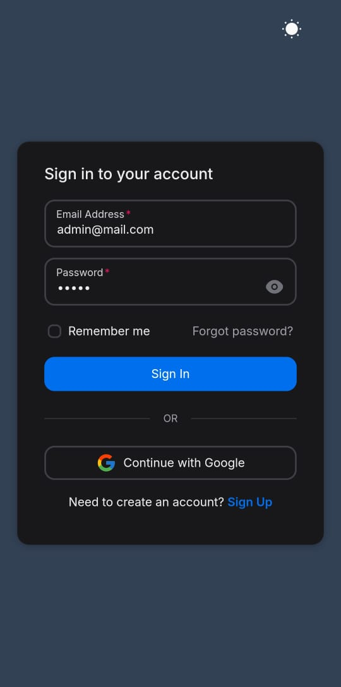
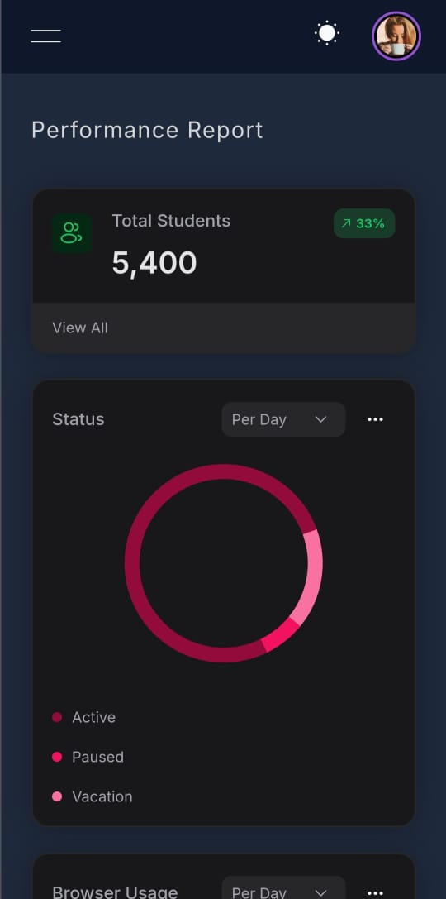
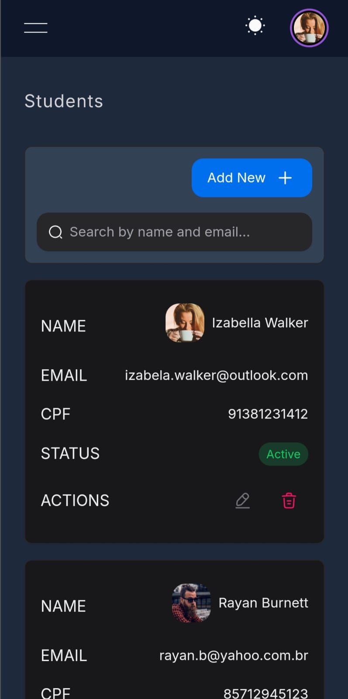
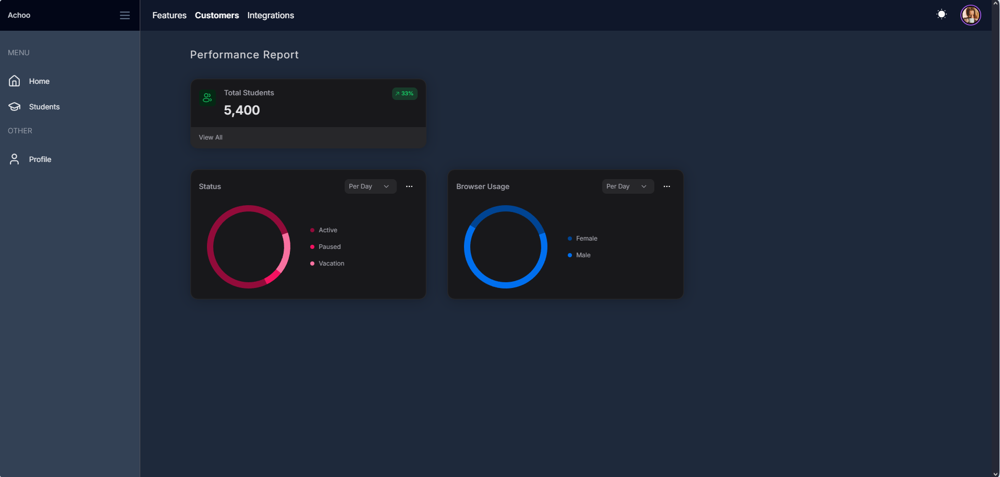
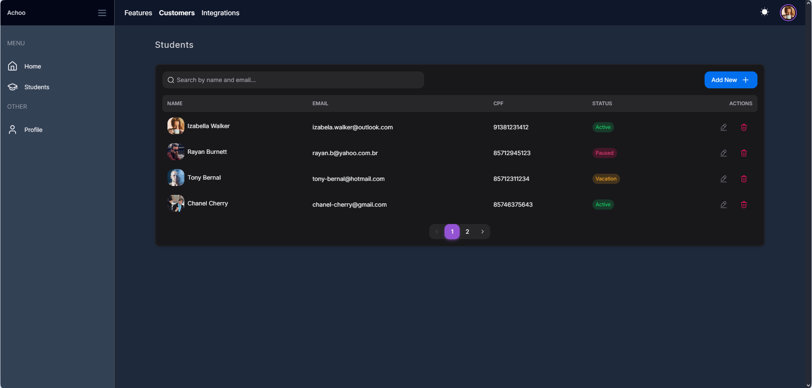

## 🎯 About

An educational platform app created to manipulate students of an educational institution.

Link: https://react-student-app.onrender.com/

## Demo 📸

<div align="center">
  <div justify="space-around">
    
    
    
  </div>

---

  <p>
    
    <p>
    
    <p>
  </p>
</div>

## 🚀 Technologies

- Next.js
- HeroUI v2
- Tailwind CSS
- Tailwind Variants
- TypeScript
- Framer Motion
- Next-themes
- Drizzle-orm
- Postgres
- Bcrypt-ts
- Jsonwebtoken
- Lucide-react
- Resend
- Eslint
- Prettier

## 📑 Features

- \[x] Register Student
- \[x] Search Students
- \[x] Update Student
- \[x] Delete Student
- \[ ] Auth - Register
- \[ ] Auth - Login with Google
- \[x] Auth - Login (Credentials)

### ✅ Requirements:
>node: 20.x

### Running the app

- git clone https://github.com/lucasCicero1/react-student-app.git

```bash
$ cd react-student-app
$ npm install
$ npm run dev
```

